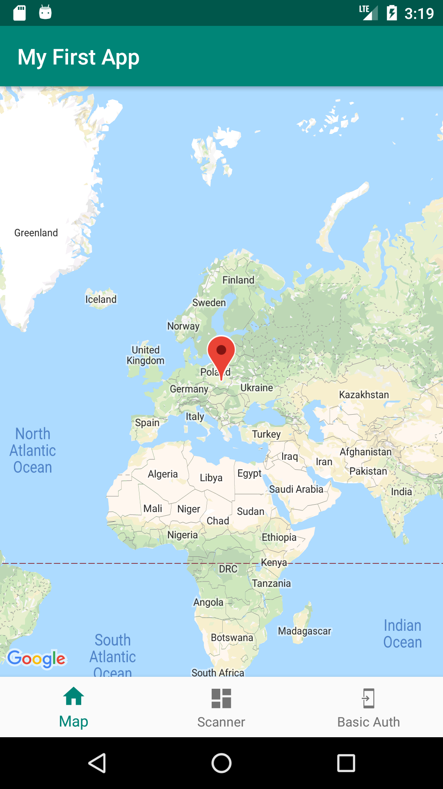
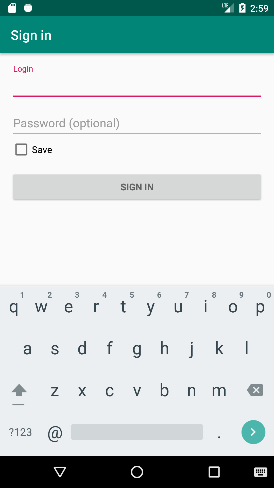
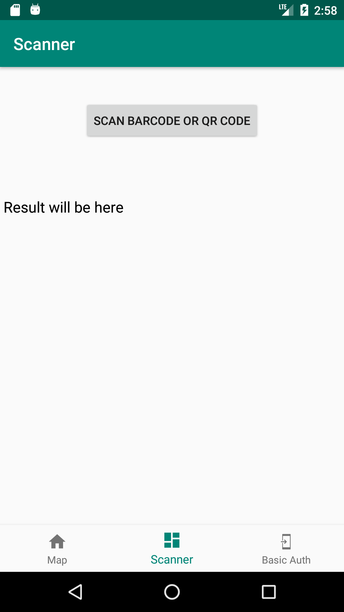
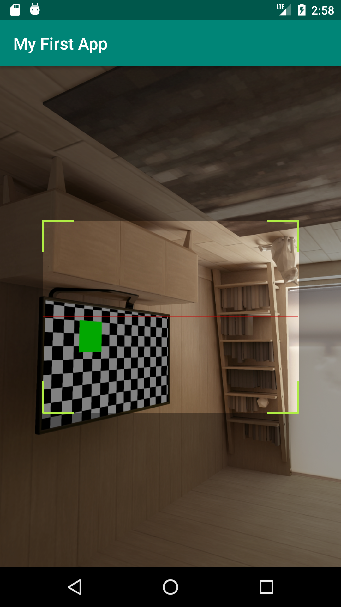
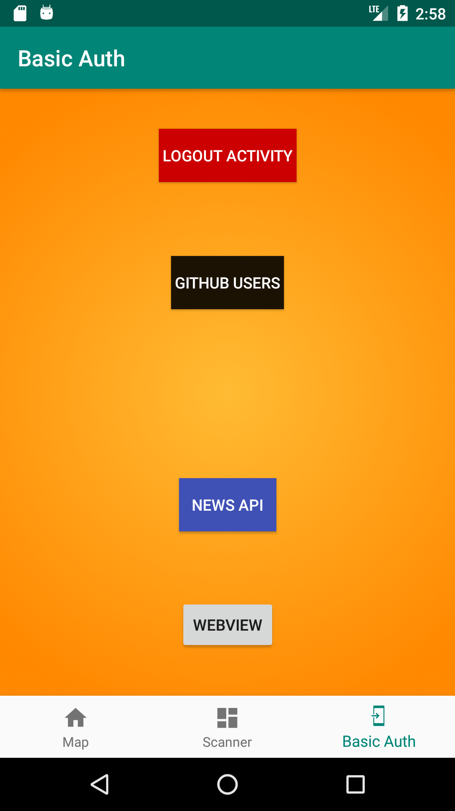
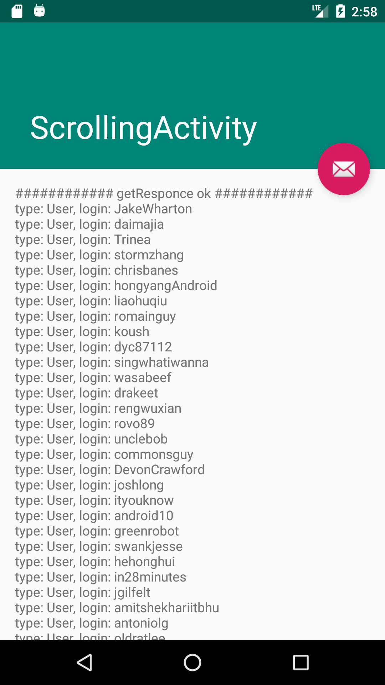
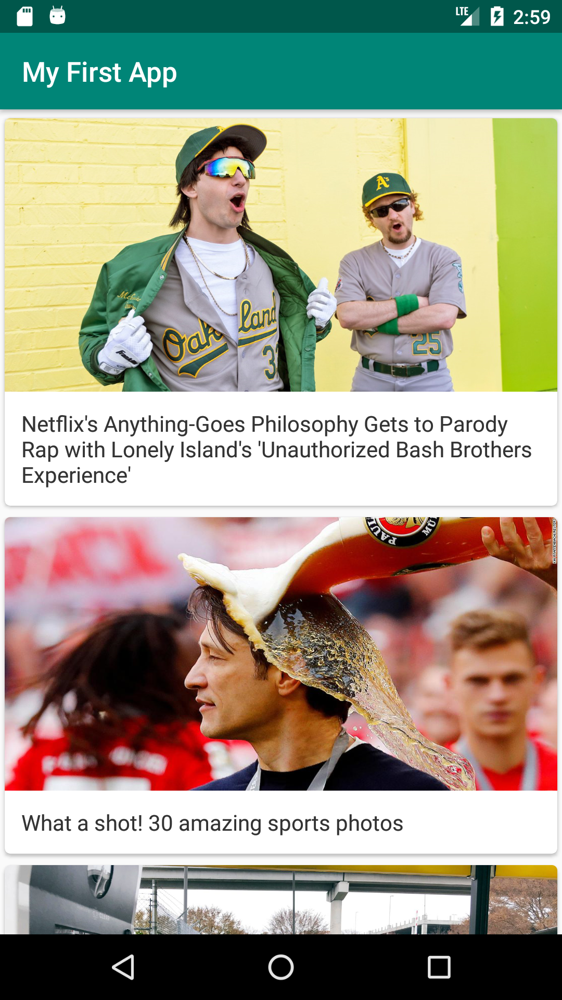
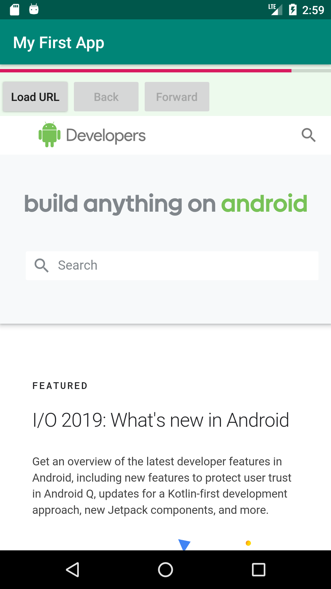

# MyFirstApp
* My first android application

## Run:
1) add to MyFirstApp/app/src/main/res/values file "google_maps_api.xml":
```
<resources xmlns:android="urn:oasis:names:tc:xliff:document:1.2">
    <string name="google_maps_key" translatable="false" templateMergeStrategy="preserve" >
    YOUR_GOOGLE_MAP_API_KEY
    </string>
</resources>
```
2) in file MyFirstApp/app/src/main/java/com/mbohdan/apps/myFirstApp/ServerApiService.kt change server url:
```
 .baseUrl("http://YOUR_URL:8080/")
```
3) run application

## SCREENS:
Descriptions | Descriptions
------------ | -------------
Main view app | Login Activity
 | 
Scanner fragment | Scanner Activity
 | 
Simple menu | Github java developers list 
 | 
News API view | WebView
 | 
